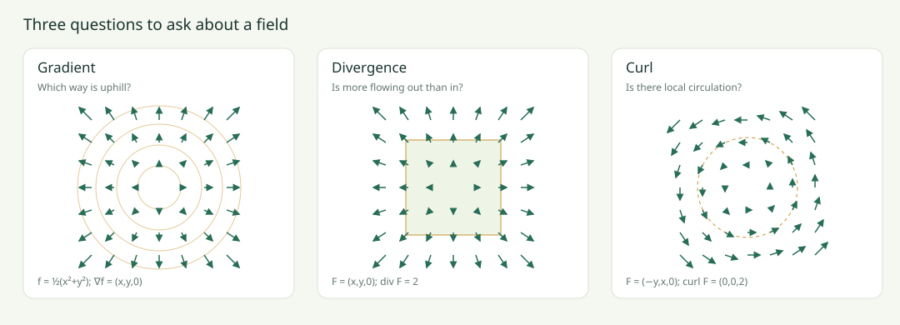

# Vector Calculus Lab

**See the field before memorising the formula.**

An interactive, dependency-free field guide to gradient, divergence, curl,
vector identities, and the geometry of integral theorems.

## Open the interactive guide

### [Launch the sliders and visualisations ↗](https://Ruchir555.github.io/vector-calculus-lab/)

GitHub READMEs do not execute JavaScript. The live guide runs on GitHub Pages;
its source lives in this repository. You can also download the repository and
open `index.html` directly in your browser. No installation is required.



## Download the proof atlas

### [Vector Calculus: An Identity and Proof Atlas (PDF)](docs/vector-calculus-atlas.pdf)

**57 numbered identities and theorem statements**, each with an index-notation
or component proof, plus exact diagrams and worked examples. The catalogue covers
delta/epsilon algebra, products and quotients, directional derivatives, dyads,
Laplacians and commutation, radial fields and point sources, integral theorems,
Green identities, and potential conditions. Assumptions appear alongside the rules.

The examples include point-mass gravity, a uniform massive sphere, near-Earth
gravity, electrostatics, fluid rotation and shear, diffusion, and electromagnetic
waves. The potential chapter explains **∂P/∂y = ∂Q/∂x**, constructs a potential,
compares paths when the condition fails, and treats a vortex on a punctured plane.

The site now has **22 interactive lessons**, including gravity, electric sources,
straight shear flow, and two experiments devoted to the mixed-partial condition.
The full [identity catalogue](IDENTITIES.md) also contains the proofs as text.

PDF source: [LaTeX](docs/vector-calculus-atlas.tex). Rebuild with
`python scripts/build_atlas.py` (NumPy, Matplotlib and pdfLaTeX required).

## A learning sequence that builds intuition

1. **Gradient:** scalar values become local uphill arrows.
2. **Divergence:** compare flow through opposite faces, not arrow length.
3. **Curl:** compare tangential flow around a tiny loop, not just curved arrows.
4. **Laplacian:** see how divergence of a gradient measures summed curvature.
5. **Zero identities:** understand mixed-partial cancellation and a misleading 2D projection.
6. **Double curl:** separate the source-gradient term from componentwise curvature.
7. **Product rules:** switch right-hand contributions off and reconstruct the result.
8. **Integral theorems:** resize the loop or square and compare interior and boundary integrals.
9. **Domain topology:** a singular vortex shows why local zero curl does not always imply global path independence.

Every lesson gives a geometric explanation, an adjustable example, a common
confusion, worked algebra, and a prediction question with a revealable answer.
The [learning guide](LEARNING_GUIDE.md) contains the complete text without JavaScript.
The [identity catalogue](IDENTITIES.md) includes the complete numbered proof reference.

## What you can manipulate

- Coefficients **a** and **b**, including negative values.
- The **z slice**, so out-of-plane structure is not silently ignored.
- The **probe position**, by clicking a plot or using arrow keys while it is focused.
- The **probe size**, for flux and circulation lessons.
- Each **right-hand contribution**, independently.
- The left panel: **original field** or **left-hand result**.
- Contours and arrows.

Read the actual values below each plot. Colours rescale per panel. Arrow
lengths use a fixed scale and are capped; grey rings identify capped arrows.
Dots/crosses denote positive/negative z components. The plots are 2D slices,
but the differential operators evaluate all three coordinates.

## Identities included

| Idea | Equation |
| --- | --- |
| Scalar Laplacian | ∇·(∇f) = ∇²f |
| Curl of gradient | ∇×(∇f) = 0 |
| Divergence of curl | ∇·(∇×A) = 0 |
| Double curl | ∇×(∇×F) = ∇(∇·F) − ∇²F |
| Gradient product | ∇(fg) = f∇g + g∇f |
| Divergence product | ∇·(fA) = f∇·A + ∇f·A |
| Curl product | ∇×(fA) = f∇×A + ∇f×A |
| Divergence of cross product | ∇·(A×B) = B·curl A − A·curl B |
| Curl of cross product | ∇×(A×B) = A div B − B div A + (B·∇)A − (A·∇)B |
| Gradient of dot product | ∇(A·B) = (A·∇)B + (B·∇)A + A×curl B + B×curl A |
| Divergence theorem | Closed outward flux = volume integral of divergence |
| Stokes’ theorem | Boundary circulation = surface integral of normal curl |

## Run or modify locally

Open `index.html` directly, or serve the folder:

```bash
python -m http.server 8000
# Open http://localhost:8000
```

For numerical checks, install Node.js 20 or newer:

```bash
npm test
```

There are no npm dependencies to install. GitHub Actions runs the same tests
on pushes and pull requests.

| File | Purpose |
| --- | --- |
| `index.html` / `style.css` | Accessible controls and responsive layout |
| `app.js` | Canvas rendering, sliders, and readouts |
| `math.js` | 3D finite-difference operators and midpoint quadrature |
| `lessons.js` | Examples, independent equation sides, and explanations |
| `math.test.cjs` | Analytic checks, identity checks, and integral checks |

## Accuracy and scope

The atlas provides a comprehensive standard Cartesian repertoire; further
identities can be derived from it. The interactive lessons illustrate selected
identities and physical applications. The differential operators use central
finite differences with step 0.0002. Tests compare against analytic polynomial
derivatives and check all examples at multiple 3D points and parameter values.
Small residuals reflect truncation and roundoff. Example checks illustrate
identities; the worked derivative arguments explain why they hold generally.

The vector Laplacian is componentwise in Cartesian coordinates. For curvilinear
coordinates, basis-vector variation must also be included. The two zero
identities and double curl assume C² fields. Integral theorems require smooth
fields on suitable regions with consistent boundary orientation. The vortex
explicitly violates smoothness at the origin.

The flux demo uses the planar divergence theorem (equivalently a unit-height
prism with no z flow); the Stokes demo uses an oriented planar square. The vortex
circulation is analytic; a disk curl integral is deliberately not evaluated
across its singularity.

## Licence

MIT. See [LICENSE](LICENSE).
